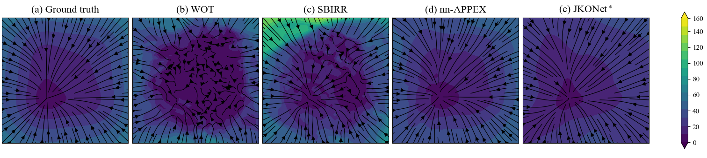
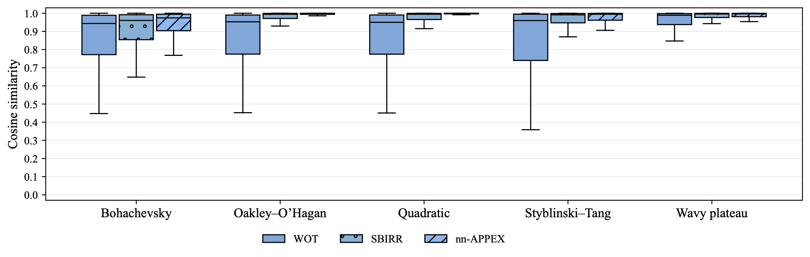

# Identifying gradient-flow SDEs

This repository contains code for
- **Data generation and visualization**: simulating population dynamics (temporal marginals) from a benchmark dataset of gradient-flow SDEs
- **SDE inference from marginals**: inferring the SDE from data with a variety of ML methods, including our method $\texttt{nn-APPEX}$
- **Interpreting inference quality**: Visualizing the potential landscape inferred by each method, and summarizing aggregate results


## Introduction

Our paper "Gradient-flow SDEs have unique transient population dynamics", proves that both the drift 
$-\nabla \Psi$ and the diffusivity $\sigma^2$ of a gradient-flow SDE,
$$
\mathrm{dX_t} = -\nabla \Psi(X_t)\mathrm{dt}{} + \sigma \mathrm{dW_t},
$$
are identifiable from their temporal marginals $\{p(\cdot, t)\}_{t \ge 0}$ if and only if are sampled outside of equilibrium. 
Furthermore, three distinct marginals, $\bigl(p(\cdot, t_i)\bigr)_{i=1}^3$ identify the true SDE with probability $1$ (see Section 4 of our paper). 
This identifiability result motivated the development of $\texttt{nn-APPEX}$, the first Schrödinger Bridge-based method, 
capable of jointly inferring gradient-driven drift $-\nabla \Psi$ and the diffusivity $\sigma^2$ (see Section 5 of our paper).
To reproduce the main experiments in our paper (summarized in Section 6 and Appendix G) follow the steps below.

## 1) Installation
Clone the repository and install dependencies via:
```bash
git clone https://github.com/guanton/identifying-gradient-flow-sdes.git
cd identifying-gradient-flow-sdes

conda env create -f environment.yml
conda activate gradient-flow-sdes
```

## 2) Run main scripts
Simply run the scripts:
```bash
./run_main_gmm.sh
./run_main_unif.sh
./run_main_gibs.sh
```
These each launch data generation, followed by inference, for the SDEs considered in our paper's main experiments. The only difference between the scripts is the initial distribution $p(\cdot,0)$ of 
the population dynamics. The scripts will save the generated data and the inferred drift fields by each method within a directory named `main_experiments`.

### a) Data generation and visualization
The code for simulating data is principally found in `data_generator.py`. Each run also stores the generated population dynamics as a gif. 
As an example, we plot the population dynamics of a gradient-flow SDE, driven by the Styblinski-Tang potential below, with a random Gaussian mixture initialization:


Note that we only generate three marginals for our main experiments, in order to mimic the setup of our identifiability theory.
The number of particles `n-particles`, the time step `dt`, and the number of observed steps `n-timesteps` can all be adjusted when running `data_generator.py'. 

### b) Inference 

The main experiments compare $\texttt{nn-APPEX}$ against previous Schrödinger Bridge-based methods, 
$\texttt{WOT}$ and $\texttt{SBIRR}$, so SDE inference is run using each of these SB methods, immediately after data generation.
Our main scripts additionally include inference by the state-of-the-art variational method 
[$\texttt{JKOnet}^\ast$](https://github.com/antonioterpin/jkonet-star)(Terpin et al., NeurIPS 2024), from which this repository was forked. 
Code for each method is run from the file `train.py`. Each method saves a parametrization of the estimated drift field on a discretized grid.
We note that hyperparameters, such as neural network parameters for estimating the drift field, can be tuned for each method.

## 3) Interpret inference quality

Once the scripts have finished, each method's drift estimate may be evaluated visually and numerically, using normalized absolute error 
and cosine similarity. 

### a) Per seed results
For each seed, the estimated fields can be visualized alongside the true one, by specifying the experiment settings 
and running `interpret_results/plot_drift_fields.py`. For example, the arguments
```bash
python -m interpret_results.plot_drift_fields \
--root main_experiments \
--p0 gmm \
--potential oakley_ohagan \
--seed 1003 \
--panels gt,wot,sbirr,nn_appex,jkonet_star \
--stream \
--background speed \
--print-metrics 
```
produces the following panel plot

and the optional argument ``--print-metrics`` reports normalized absolute error and cosine similarity.
```
[metrics]              wot :  normalized_MAE=0.4571   cosine=0.7129
[metrics]            sbirr :  normalized_MAE=0.5215   cosine=0.8991
[metrics]         nn_appex :  normalized_MAE=0.1839   cosine=0.9960
[metrics]      jkonet_star :  normalized_MAE=0.4168   cosine=0.9886
```

### b) Aggregate results
To obtain the performance metrics of the methods for a given experiment setting (specified by `p0`), we may save 
tables and plots, which summarize aggregate performance. A csv summarizing the five-number statistical summary
corresponding to a box-and-whisker-plot is created by running `interpret_results/create_results_csv.py`. For example,
using the following arguments
```bash
python -m interpret_results.create_results_csv \
  --root main_experiments \
  --setting p0-gmm \
  --potentials poly,styblinski_tang,bohachevsky,wavy_plateau,oakley_ohagan \
  --methods nn_appex,wot,sbirr,jkonet_star \
  --metrics grid_mae,grid_cos,diff_mae \
  --seeds 1000,1001,1002,1003,1004,1005,1006,1007,1008,1009 \
  --save-dir results_csvs \
  --box-only --whisker-mult 1.5
```
will save two csvs (one for normalized MAE and one for cosine similarity). If the ``--box-only`` argument is removed,
then we will also save a detailed csv of the metric values for each method, at each point in the discretized grid. 
Since only $\texttt{JKOnet}^\ast$ and $\texttt{nn}-APPEX$ estimate the diffusivity, running the code with these methods
with the metric `diff_mae`, will create a csv summarizing diffusivity estimation.

Finally, to create box plot figures, we simply run `interpret_results/make_boxplot_pdfs.py` by passing the filepaths of the
boxplot csvs. For example, the following arguments
```bash
python -m interpret_results.make_boxplot_pdfs \
  --mae results_csvs/metric=grid_mae_p0-gmm_boxagg_wiqr1.5.csv \
  --cos results_csvs/metric=grid_cos_p0-gmm_boxagg_wiqr1.5.csv \
  --outdir results_plots \
  --methods wot,sbirr,nn_appex \
  --legend
```
would create two separate boxplot pdfs in a folder named `results_plots`. The output should look something like this



