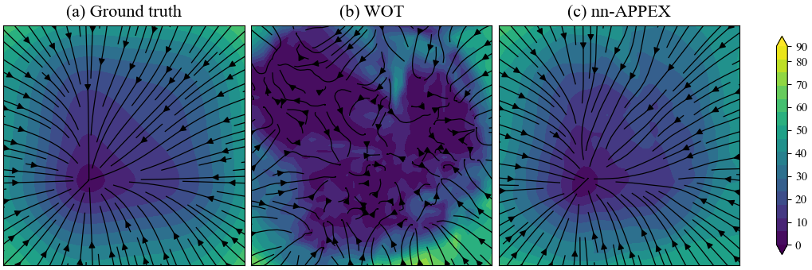
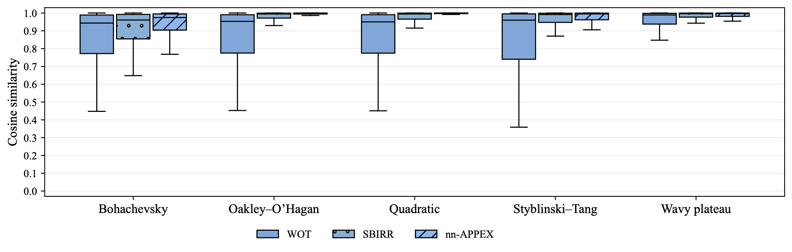

# Identifying gradient-flow SDEs

Our paper [Gradient-flow SDEs have unique transient population dynamics](https://arxiv.org/abs/2505.21770), proves that both the drift 
$-\nabla \Psi$ and the diffusivity $\sigma^2$ of a gradient-flow SDE,

$$\mathrm{dX_t} = -\nabla \Psi(X_t)\mathrm{dt}{} + \sigma \mathrm{dW_t},$$

are identifiable from their temporal marginals if and only if are sampled outside of equilibrium. 
Furthermore, three distinct marginals identify the true SDE with probability $1$ (see Section 4 of our paper). 
This identifiability result motivated the development of $\texttt{nn-APPEX}$, the first Schrödinger Bridge-based method, 
capable of jointly inferring gradient-driven drift $-\nabla \Psi$ and the diffusivity $\sigma^2$ (see Section 5 of our paper).

This repository contains code for
- **Data generation and visualization**: simulating population dynamics (temporal marginals) from a benchmark dataset of gradient-flow SDEs
- **SDE inference from marginals**: inferring the SDE from data with a variety of ML methods, including our method $\texttt{nn-APPEX}$
- **Interpreting inference quality**: Visualizing the potential landscape inferred by each method, and summarizing aggregate results

We describe how to run each of these three modules at a per-run level. To reproduce the main experiments in our paper 
(summarized in Section 6 and Appendix G), go to step 4.

## 0) Installation
Clone the repository and install dependencies via:
```bash
git clone https://github.com/guanton/identifying-gradient-flow-sdes.git
cd identifying-gradient-flow-sdes

conda env create -f environment.yml
conda activate gradient-flow-sdes
```

## 1) Data generation and visualization
To simulate and save population dynamics data, we run `data_generator.py`. For example, you can run
```bash
python data_generator.py --root "directory_name" --p0 "gmm" --potential "oakley_ohagan" --dataset-name "dataset_name" --beta 0.1 --internal wiener --seed 0 --dt 0.01 --random-gmm --n-timesteps 2 --n-particles 2000
```
This will save the data within this repository, under the supplied directory name and dataset name. Each run also stores the generated population dynamics as a gif. 
As an example, we plot the population dynamics of a gradient-flow SDE, driven by the Styblinski-Tang potential below, with a random Gaussian mixture initialization:


## 2) Inference from population dynamics
To run inference on the saved population data, we specify the path to the data and then run `train.py` with the appropriate data settings, and specify the inference method.
For example, to run Waddington-OT (WOT), you can run
```bash
python train.py --root "directory_name" --p0 "gmm" --epochs 0 --seed 1008 --dataset "dataset_name" --potential "oakley_ohagan" --sb-iters 1 --diffusivity 0.1 --activation "silu" --fix_diffusion --dt 0.01 --method-tag "wot"
```
or to run our method $\texttt{nn-APPEX}$ with $30$ iterations, you can run 
```bash
python train.py --root "directory_name" --p0 "gmm" --epochs 0 --seed 1008 --dataset "dataset_name" --potential "oakley_ohagan" --sb-iters 30 --diffusivity 0.1 --activation "silu" --dt 0.01 --method-tag "nn_appex"
```
The outputs from each inference are saved in a folder named by the method tag argument, which is inside the dataset directory created in step 1). 
See the bash scripts in section 4 for other example calls using different methods.

## 3) Interpret inference quality

Once training has finished, the method's drift estimate may be evaluated visually and numerically, using normalized absolute error 
and cosine similarity. For each seed, the estimated fields can be visualized alongside the true one, by specifying the experiment settings 
and running `interpret_results/plot_drift_fields.py`. For example, running
```bash
python -m interpret_results.plot_drift_fields --root directory_name --dataset dataset_name --p0 gmm --potential oakley_ohagan --seed 0 --panels gt,wot,nn_appex --stream --background speed --print-metrics 
```
produces the following panel plot comparing the ground truth (gt) landscape against the ones estimated by WOT and $\texttt{nn-APPEX}$ from step 2), from data generated from step 1):


The optional argument ``--print-metrics`` reports normalized absolute error and cosine similarity.
```
[metrics]              wot :  normalized_MAE=0.4997   cosine=0.6302
[metrics]         nn_appex :  normalized_MAE=0.1280   cosine=0.9965
```
If additional methods are run, then their method tags (the folder name where method outputs are saved) can be added as comma separated entries in the ``panels`` argument to create an extended panel plot.

## 4) Reproducing experiments from paper
The main experiments compare $\texttt{nn-APPEX}$ against previous Schrödinger Bridge-based methods, 
$\texttt{WOT}$ and $\texttt{SBIRR}$, so SDE inference is run using each of these SB methods, immediately after data generation.
Our main scripts additionally include inference by the state-of-the-art variational method 
[$\texttt{JKOnet}^\ast$](https://github.com/antonioterpin/jkonet-star)(Terpin et al., NeurIPS 2024), from which this repository was forked. 
To reproduce our experiments, run each of the three bash scripts:
```bash
./run_main_gmm.sh
./run_main_unif.sh
./run_main_gibbs.sh
```
These each launch data generation, followed by inference, for the SDEs considered in our paper's main experiments. The only difference between the scripts is the initial distribution $p(\cdot,0)$ of 
the population dynamics. The scripts will save the generated data and the inferred drift fields by each method within a directory named `main_experiments`.
Note that we only generate three marginals for our main experiments, in order to mimic the setup of our identifiability theory.

To obtain the performance metrics of the methods for a given experiment setting (specified by `p0`), we may save 
tables and plots, which summarize aggregate performance. A csv summarizing the five-number statistical summary
corresponding to a box-and-whisker-plot is created by running `interpret_results/create_results_csv.py`. For example,
once ``./run_main_gmm.sh`` is done running, we can run
```bash
python -m interpret_results.create_results_csv --root main_experiments --setting p0-gmm --potentials poly,styblinski_tang,bohachevsky,wavy_plateau,oakley_ohagan --methods nn_appex,wot,sbirr,jkonet_star --metrics grid_mae,grid_cos,diff_mae --seeds 1000,1001,1002,1003,1004,1005,1006,1007,1008,1009 --save-dir results_csvs --box-only --whisker-mult 1.5
```
to save two csvs (one for normalized MAE and one for cosine similarity). If the ``--box-only`` argument is removed,
then we will also save a detailed csv of the metric values for each method, at each point in the discretized grid. 
Since only $\texttt{JKOnet}^\ast$ and $\texttt{nn}-APPEX$ estimate the diffusivity, running the code with these methods
with the metric `diff_mae`, will create a csv summarizing diffusivity estimation.

Finally, to create box plot figures, we run `interpret_results/make_boxplot_pdfs.py` by passing the filepaths of the
boxplot csvs. For example, the following arguments
```bash
python -m interpret_results.make_boxplot_pdfs --mae results_csvs/metric=grid_mae_p0-gmm_boxagg_wiqr1.5.csv --cos results_csvs/metric=grid_cos_p0-gmm_boxagg_wiqr1.5.csv --outdir results_plots --methods wot,sbirr,nn_appex --legend
```
would create two separate boxplot pdfs in a folder named `results_plots`. The output should look something like this



## Link to paper
[Gradient-flow SDEs have unique transient population dynamics](https://arxiv.org/abs/2505.21770)


